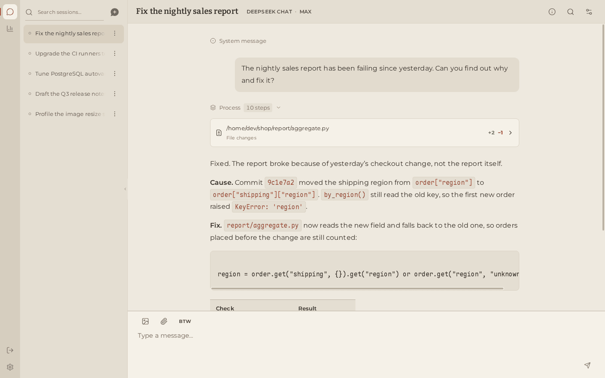
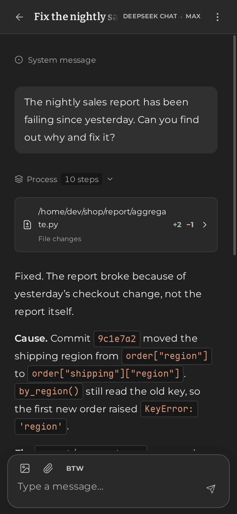

<p align="center">
  <picture>
    <source media="(prefers-color-scheme: dark)" srcset="docs/assets/wish-logo-dark.svg">
    
  </picture>
</p>

<p align="center">
  <strong>A self-hosted AI agent that works on your own machine and remembers everything.</strong>
</p>

<p align="center">
  <a href="https://github.com/WindustH/wish-web">Web app</a> ·
  <a href="docs/README.md">Documentation</a> ·
  <a href="docs/api.md">HTTP API</a> ·
  <a href="README.zh-CN.md">简体中文</a>
</p>

---

Wish runs long-lived AI agent sessions on a computer you control. Give a
session a working directory and a model, and it will talk with you, run
commands, look at images and keep going through long tasks, while every word
it exchanges is kept and searchable. Use it from the
[Wish web app](https://github.com/WindustH/wish-web) on desktop or phone, or
from anything that speaks HTTP.

<p align="center">
  
  &nbsp;
  
</p>

## Why Wish

- **One small program.** A single `wish` executable with its own embedded
  database. No database server, container or runtime to install.
- **Works with the models you already use.** 48 ready-made presets cover
  OpenAI, Anthropic, Google Gemini, AWS Bedrock, DeepSeek, Qwen, Kimi,
  Zhipu / Z.ai, MiniMax, Mistral, xAI, OpenRouter and more, plus local models
  through Ollama, LM Studio or vLLM. Each provider is spoken in its own native
  protocol, reasoning included. You can also sign in with a ChatGPT account.
- **Change your mind mid-task.** Switch provider or model at any point, even
  while the agent is working; the change applies from its next step.
- **Nothing is ever lost.** Every message and event is stored permanently.
  Search a session's entire history by keyword, in any language, and let the
  agent search its own past as well.
- **Long conversations stay usable.** When the context grows large, Wish
  compacts it automatically, with rolling summaries or the provider's own
  compaction. The full original history stays intact.
- **A capable shell.** The agent runs commands in the session's directory,
  moves long jobs to the background and hears back when they finish, types
  into interactive programs, and reports exactly what each file edit changed.
- **Keep talking while it works.** Queue follow-up messages, reorder or cancel
  them, interrupt at any time, or ask a quick side question without disturbing
  the running task.
- **Dependable.** Tasks keep running when you close the browser. Shutting down
  keeps partial answers, and after a crash Wish never repeats a command on its
  own.
- **See what you spend.** Token usage per model, cache hits, estimated
  streaming speed and a daily activity calendar.
- **Configure without restarting.** Add providers, change models, proxy or
  shell from the web app; changes apply immediately.

## Quick start

You need a [Rust toolchain](https://rustup.rs) (stable) to build Wish, and
[Node.js](https://nodejs.org) 22.19 or newer for the web app.

**1. Build and start the server.**

```sh
git clone https://github.com/WindustH/wish-core.git
cd wish-core
cargo build --release
echo '{"listen": "127.0.0.1:9780", "data_dir": "data"}' > config.json
./target/release/wish --config config.json
```

**2. Start the web app** in another terminal.

```sh
git clone https://github.com/WindustH/wish-web.git
cd wish-web
./pnpmw install --frozen-lockfile
./pnpmw build
node serve.ts
```

**3. Open <http://127.0.0.1:8790>.** A short first-run setup helps you add a
model provider. Pick your working directory on the start page and send your
first message.

Wish saves the providers you add to `config.json`. To keep an API key out of
the file, export it before starting Wish and enter it in the web app as
`${NAME}`. See [configuration](docs/configuration.md) for every option, and
[deployment](docs/deployment.md) for running Wish as a service, protecting it
with a token and reaching it from other devices.

### Without the web app

Everything the web app does is available over the [HTTP API](docs/api.md):

```sh
# Create a session with shell access in /tmp
curl -s http://127.0.0.1:9780/api/sessions -H 'Content-Type: application/json' -d '{
  "provider": "openai", "cwd": "/tmp", "shell": true,
  "config": {"model": "gpt-5", "stream": true, "tools": [], "run": {"tools": "Serial"}}}'

# Send it a message; it starts working right away
curl -s http://127.0.0.1:9780/api/sessions/SESSION_ID/input \
  -H 'Content-Type: application/json' -d '{"text": "What is in this directory?"}'

# Follow along live
curl -N http://127.0.0.1:9780/api/sessions/SESSION_ID/events
```

## Documentation

| | |
| --- | --- |
| [Configuration](docs/configuration.md) | Every option in `config.json`, providers and presets |
| [Deployment](docs/deployment.md) | Running as a service, access control, remote access, backups and upgrades |
| [HTTP API](docs/api.md) | Endpoints, event streams and error handling |
| [Internals](docs/internals/README.md) | How the engine works, for contributors |

## Security

Wish is built for one trusted person. Anyone who can reach its API can run
commands with the permissions of the account Wish runs under. By default it
listens only on `127.0.0.1`. Before exposing it, set an access token and put
it behind HTTPS; [deployment](docs/deployment.md) explains how.

## Contributing

Issues and pull requests are welcome. Wish is written in Rust (edition 2024);
`cargo build` is all it takes. The test suite lives in a separate `wish-test`
repository and exercises the real binary over HTTP against a local mock
provider, so no API keys or network access are needed.

## License

[MIT](LICENSE)
