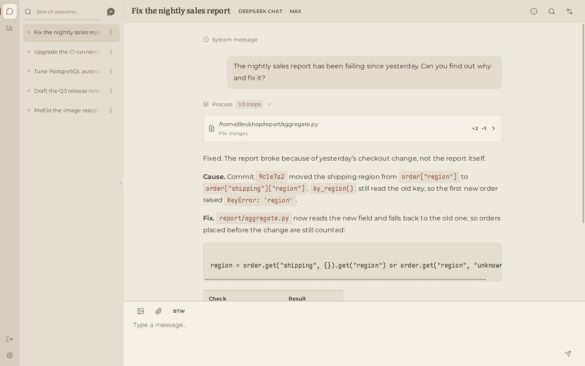

<p align="center">
  <picture>
    <source media="(prefers-color-scheme: dark)" srcset="docs/assets/wish-logo-dark.svg">
    
  </picture>
</p>

<p align="center">
  <strong>A minimal yet ready-to-use AI agent harness, built on best practices for frontier models.</strong>
</p>

<p align="center">
  <a href="https://github.com/WindustH/wish-web">Web app</a> ·
  <a href="docs/README.md">Documentation</a> ·
  <a href="docs/api.md">HTTP API</a> ·
  <a href="README.zh-CN.md">简体中文</a>
</p>

---

Wish is a minimal, fast AI agent that runs on your own machine. Use it from
the [web app](https://github.com/WindustH/wish-web) on desktop or phone, or over
the [HTTP API](docs/api.md).

<p align="center">
  
  &nbsp;
  
</p>

## Why Wish

- **Minimal and fast.** One Rust program with its own embedded database;
  nothing else to install or run.
- **Tools and skills load on demand.** MCP servers and skills (the `SKILL.md`
  folders other agents use too) are looked up and called from the shell only
  when a task needs them, so adding more never grows the model's context or
  resets its prompt cache.
- **Lean tool design.** A few general tools: a shell with background jobs and
  exact file edits, image viewing, web search, questions to you and a search of
  its own history. Everything else goes through the shell.
- **Ready to use.** Install it, run `wish` and open the browser. Presets cover
  the major model providers and local models.

## Quick start

**1. Install Wish** with whichever package manager you use:

```sh
npm install -g wish-agent               # Linux, macOS and Windows
yay -S wish-agent-bin                   # Arch Linux
brew install windusth/tap/wish-agent    # macOS and Linux
```

The packages install the `wish` command, which can't sit beside Tk's `wish` on
Arch Linux or Homebrew.

**2. Start it.**

```sh
wish
```

**3. Open <http://127.0.0.1:8790>.** A short first-run setup helps you add a
model provider. Pick your working directory on the start page and send your
first message.

The first start writes a configuration for your user
(`~/.config/wish-agent/config.json` on Linux) and keeps its data beside it. See
[configuration](docs/configuration.md) for every option, and
[deployment](docs/deployment.md) for running Wish as a service and reaching it
from other devices.

### From source

You need a [Rust toolchain](https://rustup.rs) (stable) and
[Node.js](https://nodejs.org) 22.19 or newer.

```sh
git clone https://github.com/WindustH/wish-web.git
(cd wish-web && ./pnpmw install --frozen-lockfile && ./pnpmw build)
git clone https://github.com/WindustH/wish-core.git
cd wish-core
cargo build --release
cp -r ../wish-web/dist target/release/web
./target/release/wish
```

### Without the web app

Everything the web app does is available over the [HTTP API](docs/api.md):

```sh
# Create a session with shell access in /tmp
curl -s http://127.0.0.1:8790/api/sessions -H 'Content-Type: application/json' -d '{
  "provider": "openai", "cwd": "/tmp", "tools": {"shell": true},
  "config": {"model": "gpt-5", "stream": true, "tools": [], "run": {"tools": "Serial"}}}'

# Send it a message; it starts working right away
curl -s http://127.0.0.1:8790/api/sessions/SESSION_ID/input \
  -H 'Content-Type: application/json' -d '{"text": "What is in this directory?"}'

# Follow along live
curl -N http://127.0.0.1:8790/api/sessions/SESSION_ID/events
```

## Documentation

| | |
| --- | --- |
| [Configuration](docs/configuration.md) | Every option in `config.json`, providers and presets |
| [Deployment](docs/deployment.md) | Running as a service, access control, remote access, backups and upgrades |
| [HTTP API](docs/api.md) | Endpoints, event streams and error handling |
| [Internals](docs/internals/README.md) | How the engine works, for contributors |

## Security

Wish is built for one trusted person. Anyone who can reach its API can run
commands with the permissions of the account Wish runs under. By default it
listens only on `127.0.0.1`, and without a token it answers only requests
addressed to it by its own name, so a web page cannot reach it through your
browser. Before exposing it, set an access token and put it behind HTTPS;
[deployment](docs/deployment.md) explains how.

## Contributing

Issues and pull requests are welcome. Wish is written in Rust (edition 2024);
`cargo build` is all it takes. The test suite lives in a separate `wish-test`
repository and exercises the real binary over HTTP against a local mock
provider, so no API keys or network access are needed.

## License

[MIT](LICENSE)
