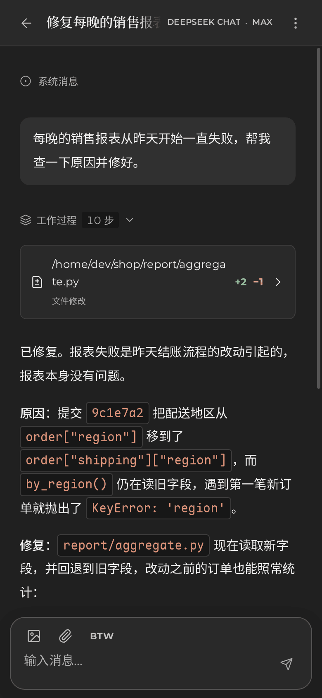

<p align="center">
  <picture>
    <source media="(prefers-color-scheme: dark)" srcset="docs/assets/wish-logo-dark.svg">
    
  </picture>
</p>

<p align="center">
  <strong>一个极简但开箱即用的 AI Agent Harness，采用贴合前沿模型的优秀实践。</strong>
</p>

<p align="center">
  <a href="https://github.com/WindustH/wish-web">Web 应用</a> ·
  <a href="docs/README.md">文档</a> ·
  <a href="docs/api.md">HTTP API</a> ·
  <a href="README.md">English</a>
</p>

---

Wish 是一个运行在你自己机器上的极简、高性能 AI 智能体。可以在桌面或手机上通过
[Web 应用](https://github.com/WindustH/wish-web) 使用，也可以调用 [HTTP API](docs/api.md)。

<p align="center">
  
  &nbsp;
  
</p>

## 为什么选择 Wish

- **极简、高性能。** 一个 Rust 程序，自带嵌入式数据库，不需要安装或运行其他任何东西。
- **工具和 Skill 动态加载。** MCP 服务器和 Skill（其他 agent 也在用的 `SKILL.md` 文件夹）只在任务需要时
  才从 Shell 里查找和调用，接入再多也不会撑大模型的上下文，也不会让提示缓存失效。
- **简洁的工具设计。** 只有几个通用工具：Shell（支持后台任务和精确的文件修改）、查看图片、联网搜索、
  向你提问、检索自己的历史。其余一切都通过 Shell 完成。
- **开箱即用。** 安装后运行 `wish`，打开浏览器即可。内置主流模型提供商与 Coding Plan、ChatGPT 和 GitHub Copilot 订阅、Magpie 网关以及本地模型的预设。

## 快速开始

**1. 安装 Wish**，用你习惯的包管理器即可：

```sh
npm install -g wish-agent               # Linux、macOS 和 Windows
yay -S wish-agent-bin                   # Arch Linux
brew install windusth/tap/wish-agent    # macOS 和 Linux
```

软件包安装的命令是 `wish`，在 Arch Linux 和 Homebrew 上不能与 Tk 的 `wish` 同时安装。

**2. 启动。**

```sh
wish
```

**3. 打开 <http://127.0.0.1:8790>。** 首次使用会有一个简短的引导，帮你添加模型提供商。
然后在首页选好工作目录，发送第一条消息即可。

首次启动会为当前用户写一份配置文件（Linux 上是 `~/.config/wish-agent/config.json`），数据也保存在它旁边。
全部选项见[配置说明](docs/configuration.md)；以服务方式运行、从其他设备访问，见[部署指南](docs/deployment.md)。

### 从源码构建

需要 [Rust 工具链](https://rustup.rs)（stable）和 [Node.js](https://nodejs.org) 22.19 或更高版本。

```sh
git clone https://github.com/WindustH/wish-web.git
(cd wish-web && ./pnpmw install --frozen-lockfile && ./pnpmw build)
git clone https://github.com/WindustH/wish-core.git
cd wish-core
cargo build --release
cp -r ../wish-web/dist target/release/web
./target/release/wish
```

### 不使用 Web 应用

Web 应用能做的一切都可以通过 [HTTP API](docs/api.md) 完成：

```sh
# 在 /tmp 中创建一个带 Shell 的会话
curl -s http://127.0.0.1:8790/api/sessions -H 'Content-Type: application/json' -d '{
  "provider": "openai", "cwd": "/tmp", "tools": {"shell": true},
  "config": {"model": "gpt-5", "stream": true, "tools": [], "run": {"tools": "Serial"}}}'

# 发送一条消息，它会立即开始工作
curl -s http://127.0.0.1:8790/api/sessions/SESSION_ID/input \
  -H 'Content-Type: application/json' -d '{"text": "这个目录里有什么？"}'

# 实时查看进展
curl -N http://127.0.0.1:8790/api/sessions/SESSION_ID/events
```

## 文档

文档目前为英文。

| | |
| --- | --- |
| [配置](docs/configuration.md) | `config.json` 的全部选项、提供商与预设 |
| [部署](docs/deployment.md) | 以服务方式运行、访问控制、远程访问、备份与升级 |
| [HTTP API](docs/api.md) | 接口、事件流与错误处理 |
| [内部实现](docs/internals/README.md) | 引擎的工作原理，面向贡献者 |

## 安全

Wish 是为单个受信任的使用者设计的。任何能访问它 API 的人，都能以 Wish 运行账户的权限执行命令。
默认只监听 `127.0.0.1`；没有设置令牌时，它只回应用它自己的地址发来的请求，
网页无法借你的浏览器操纵它。在对外开放之前，请设置访问令牌并通过 HTTPS 提供服务，
具体做法见[部署指南](docs/deployment.md)。

## 参与贡献

欢迎提交 Issue 和 Pull Request。Wish 使用 Rust（edition 2024）编写，`cargo build` 即可构建。
测试套件位于独立的 `wish-test` 仓库，通过 HTTP 驱动真实的程序并连接本地模拟的提供商，不需要 API 密钥，也不需要联网。

## 许可证

[MIT](LICENSE)
